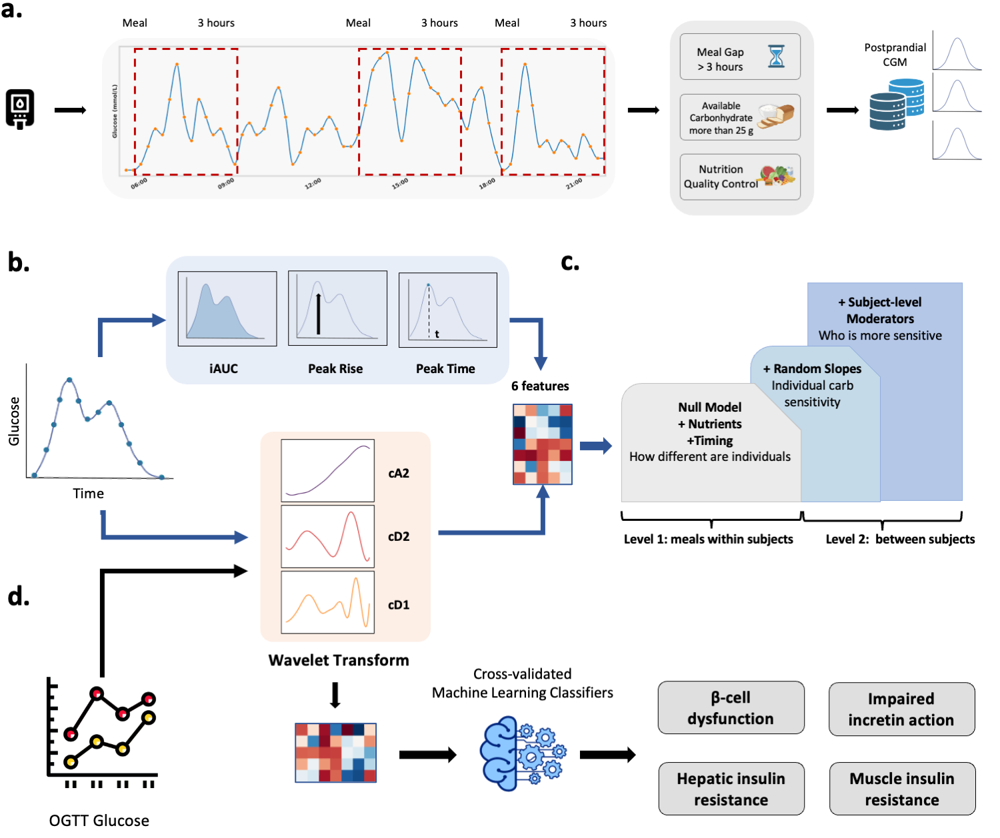

# Temporal structure in postprandial glycemia identifies a personalization gap and high-risk metabolic profiles

This repository includes code for the manuscript "Temporal structure in postprandial glycemia identifies a personalization gap and high-risk metabolic profiles".

Postprandial glucose responses are central to metabolic health, but most studies reduce these complex physiological signals to summary measures such as incremental area under the curve. Here, we applied Wavelet Transform (WT) to 76,083 postprandial glucose responses from 4,316 adults monitored under free-living conditions, decomposing each response into slow and rapid temporal components. Using multilevel mixed-effects models with centering-within-cluster decomposition, we quantified inter-individual variability in carbohydrate sensitivity across temporal scales, identified a substantial personalization gap unexplained by measured dietary, clinical, and molecular factors, and linked participant-specific response profiles to cardiometabolic risk, and validated the multi-scale features on an independent OGTT cohort on classification of mechanistically defined dysglycemia endotypes.

## This repository contains code used for:

- SWT (db2, level 2) feature extraction from postprandial CGM curves. Three frequency-band energies (cA2, cD2, cD1) alongside conventional scalar metrics (iAUC, peak glucose rise, time to peak). 
- Progressive multilevel model building (null, nutrients, meal timing, random carbohydrate slopes) with variance component analysis (ICC, Nakagawa R-squared, personalization gap). BLUP extraction with per-person reliability estimation and meals-needed projections.
- Multi-nutrient random slope models and cross-nutrient sensitivity correlations.
- Cross-level interaction analysis: independent screening and joint moderator model.
- Probabilistic phenotype classification into four metabolic subtypes with cardiometabolic and pre-diabetes validation.
- External validation on the OGTT dataset: discrimination of mechanistically defined dysglycemia endotypes.

## Data availability

The primary dataset (HPP) is available at [Human Phenotype Project](https://humanphenotypeproject.org/) upon application. The external validation dataset is publicly available at [Metabolic Subphenotype Predictor](https://storage.googleapis.com/gbsc-gcp-project-ipop_public/metabolic_subphenotype_db/metabolic_subphenotypes_db.zip).

## Prerequisites

#### Python (version 3.10.20) and the following packages:

- numpy, pandas, scipy==1.15.2, statsmodels==0.14.6, PyWavelets==1.8.0, scikit-learn==1.7.2, scikit-bio==0.7.0